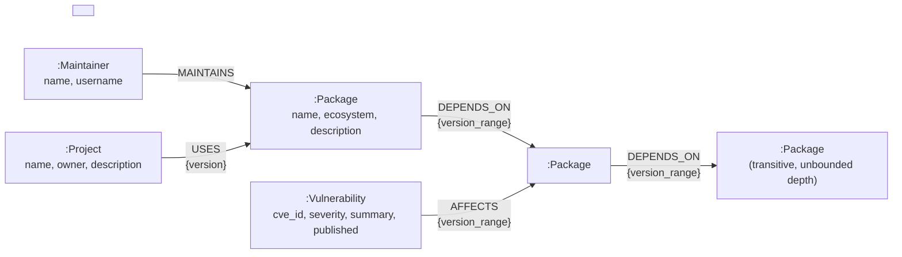
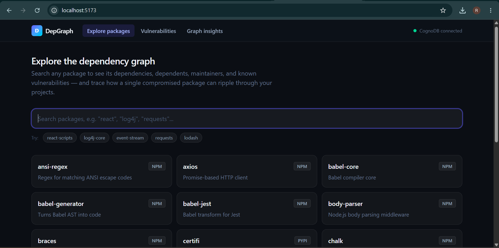
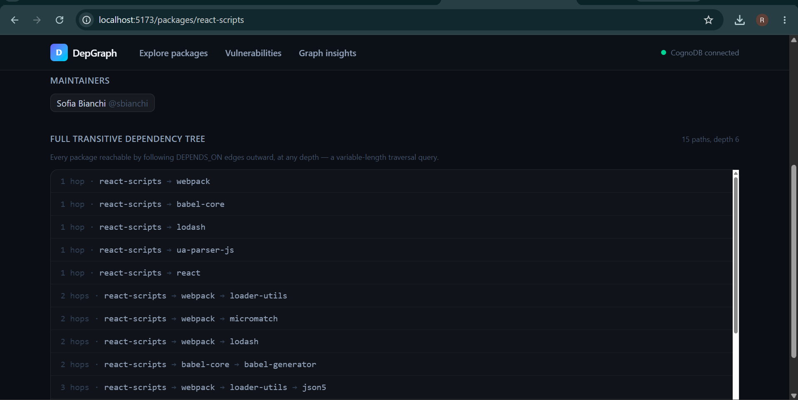
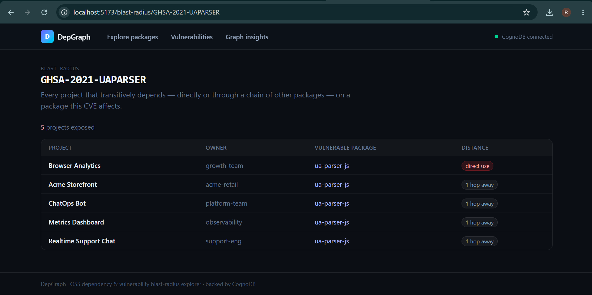
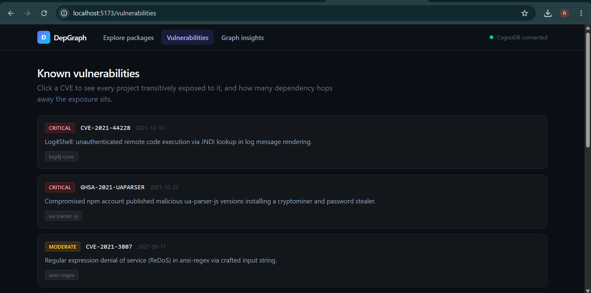
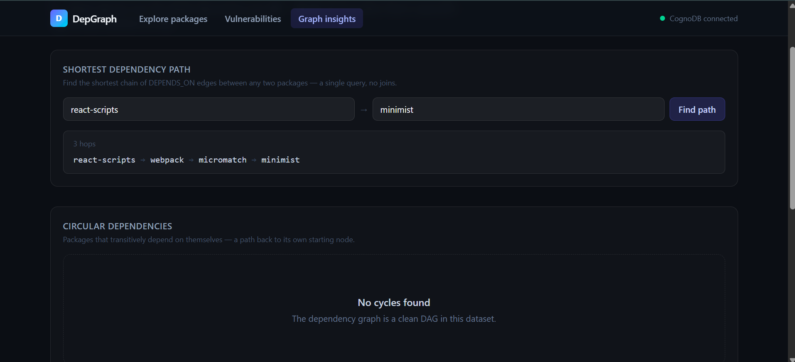
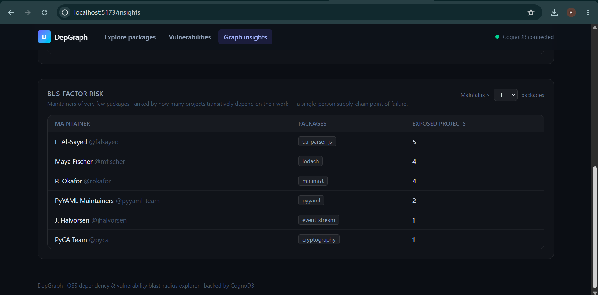

# DepGraph

**A dependency & supply-chain vulnerability blast-radius explorer, backed by [CognoDB](https://console.cognodb.com).**

Open-source software forms a dependency graph: your project depends on packages, which depend on
other packages, several layers deep. When one of those packages turns out to be malicious or
carries a critical CVE, the real question is never "is this package affected?" — it's **"which of
our projects are exposed, and how many hops of dependencies away is the danger?"** That question is
a graph traversal by nature, and DepGraph answers it live against a real dataset modeled on
real-world incidents: Log4Shell, the `event-stream` supply-chain compromise, the `ua-parser-js`
account takeover, and several well-known prototype-pollution and ReDoS CVEs.

> Live demo: **[depgraph-1.onrender.com](https://depgraph-1.onrender.com)** (backend API: [depgraph-8giy.onrender.com](https://depgraph-8giy.onrender.com))
> Screen recording: **[Google Drive](https://drive.google.com/file/d/1yyk2w4ZhetAQWsN1H3ZwGydRhJkI9VhY/view?usp=drive_link)**
>
> Note: both are on Render's free tier, which spins down after inactivity — the first request after
> a period of no traffic can take up to ~50 seconds to wake back up.

## Contents

- [Why a graph database?](#why-a-graph-database)
- [Data model](#data-model)
- [Project structure](#project-structure)
- [Setup](#setup)
- [Running it](#running-it)
- [The queries, explained](#the-queries-explained)
- [Screenshots](#screenshots)
- [Deployment](#deployment)

## Why a graph database?

The core feature of this app — **blast radius**: "which projects transitively depend on a package
affected by CVE-X, and how far away is the exposure?" — requires walking a chain of `DEPENDS_ON`
edges of *unknown, unbounded length*, starting from every project's direct dependencies, until it
either reaches the vulnerable package or doesn't.

In a relational schema, a self-referencing `depends_on(package_id, depends_on_id)` table forces
that into a **recursive CTE with a hard-coded max depth**, joined against a many-to-many
`project_packages` table, then joined again against `vulnerability_affects`. It works, but:

- You have to guess and hard-code a max recursion depth up front (real dependency trees can be 10+
  levels deep — pick wrong and you silently miss exposure).
- Every hop is another self-join, so the query gets quadratically slower as the graph grows and the
  query planner has no notion of "traverse until you find X" — it has to materialize the whole
  reachable set.
- Cycle detection (a package that transitively depends on itself — see `cypher/queries.cypher`)
  needs manual visited-node bookkeeping inside the recursive CTE to avoid an infinite loop.
- Shortest-path-between-two-packages needs a totally different, uglier query (typically a
  breadth-first walk simulated with an iterative CTE and a `LIMIT 1`).

In Cypher, each of those is a single pattern:

```cypher
MATCH path = (entry)-[:DEPENDS_ON*0..8]->(vulnerable)
```
```cypher
MATCH path = (p:Package)-[:DEPENDS_ON*2..8]->(p)          -- cycle detection
```
```cypher
MATCH path = shortestPath((a)-[:DEPENDS_ON*..10]->(b))    -- shortest path
```

The database's storage itself mirrors the shape of the problem — pointer-chasing between adjacent
records — so traversal cost is proportional to what's actually touched, not to the size of the
whole dataset. That's the case a graph database earns its place: **when the question is about the
shape of connections, not about aggregating rows.**

## Data model



| Label | Key properties | Meaning |
|---|---|---|
| `Package` | `name` (unique), `ecosystem`, `description` | An npm / PyPI / Maven package |
| `Vulnerability` | `cve_id` (unique), `severity`, `summary`, `published` | A CVE or advisory |
| `Maintainer` | `username` (unique), `name` | A person who publishes packages |
| `Project` | `name` (unique), `owner`, `description` | An internal app/service that uses packages |

| Relationship | Direction | Properties | Meaning |
|---|---|---|---|
| `(:Package)-[:DEPENDS_ON]->(:Package)` | package → its dependency | `version_range` | Direct dependency edge; chained, this is what makes the graph transitive |
| `(:Vulnerability)-[:AFFECTS]->(:Package)` | vuln → package | `version_range` | Which package versions a CVE affects |
| `(:Maintainer)-[:MAINTAINS]->(:Package)` | maintainer → package | — | Publishing ownership (used for bus-factor analysis) |
| `(:Project)-[:USES]->(:Package)` | project → direct dep | `version` | Entry point for blast-radius traversals |

Constraints (uniqueness on `name`/`cve_id`/`username`) live in [`cypher/schema.cypher`](cypher/schema.cypher)
and are applied automatically by the seed script.

## Project structure

```
backend/            FastAPI application (the API)
  app/
    main.py          App wiring, CORS, startup connectivity check, 503 handler
    config.py        Settings read from environment variables (pydantic-settings)
    db.py            Neo4j driver lifecycle + run_query() -- the single place Cypher is executed
    queries.py        Every Cypher statement used by the API, fully parameterised, with comments
    routers/
      packages.py     /api/packages/* endpoints
      graph.py         /api/vulnerabilities, /api/blast-radius, /api/shortest-path, /api/cycles, /api/bus-factor
  requirements.txt

frontend/            React + TypeScript + Vite + Tailwind SPA
  src/
    api/client.ts     Typed fetch wrapper against the backend
    components/       Shared Layout (nav + live DB-status indicator) and Loading/Empty/Error states
    pages/            Home (search), PackageDetail, Vulnerabilities, BlastRadius, GraphInsights

seed/                One-shot data loader
  data.py             The seed dataset (realistic, modeled on real incidents)
  seed.py             Loads data.py into CognoDB via parameterised UNWIND writes

cypher/               The application's Cypher, as plain runnable .cypher files (mirrors queries.py)
  schema.cypher
  queries.cypher
```

## Setup

### 1. Create a CognoDB Cloud instance

1. Go to [console.cognodb.com/signup](https://console.cognodb.com/signup) and create a free
   account (no credit card required).
2. From the console, create a free **c0** instance and pick a region. It provisions in under a
   minute.
3. Copy the connection URI (`bolt+s://<instance-id>.databases.cognodb.cloud`) and the generated
   password for the `cognodb` user — **the password is shown exactly once.**

### 2. Backend

```bash
cd backend
python -m venv .venv
.venv\Scripts\activate        # Windows; use `source .venv/bin/activate` on macOS/Linux
pip install -r requirements.txt
copy .env.example .env        # then fill in NEO4J_URI / NEO4J_USER / NEO4J_PASSWORD
```

> Note: `pydantic-core` ships prebuilt wheels for released Python versions but not always for a
> brand-new release. If `pip install` tries to compile it from source and fails, use Python 3.11–3.13.

### 3. Seed the database

```bash
cd seed
pip install -r requirements.txt
python seed.py            # loads ~55 packages, ~40 dependency edges, 8 CVEs, 23 maintainers, 15 projects
# python seed.py --wipe   # add --wipe to clear the graph first (safe to re-run any time)
```

The loader reads `backend/.env` automatically, so you only need one `.env` file.

### 4. Frontend

```bash
cd frontend
npm install
copy .env.example .env    # VITE_API_URL, defaults to http://localhost:8000
```

## Running it

```bash
# terminal 1
cd backend && .venv\Scripts\activate && uvicorn app.main:app --reload --port 8000

# terminal 2
cd frontend && npm run dev
```

Open `http://localhost:5173`. The header shows a live "CognoDB connected / unreachable" indicator
(polled every 30s via `/api/health`) — if the database is down or misconfigured, every page shows a
clean error banner instead of a stack trace; this is exercised end-to-end, not just handled in
theory (see `app/db.py` — it normalizes driver connection errors, DNS resolution failures, and
socket errors alike into a single `DatabaseUnavailable` → HTTP 503).

## The queries, explained

All Cypher lives in [`backend/app/queries.py`](backend/app/queries.py) (executed by the API,
parameterised) and is mirrored as plain runnable statements in
[`cypher/queries.cypher`](cypher/queries.cypher) (for reading or pasting into a Cypher browser).

- **Package detail** (`PACKAGE_DETAIL`) — one query, four `OPTIONAL MATCH` clauses, returns a
  package's dependencies, dependents, maintainers, and vulnerabilities in a single round trip.
- **Dependency tree** (`DEPENDENCY_TREE`) — `[:DEPENDS_ON*1..6]`, a **multi-hop variable-length
  traversal**: every package reachable downstream from a root, at any depth up to 6.
- **Blast radius** (`BLAST_RADIUS`) — the headline query. For a CVE, finds every `Project` whose
  direct dependency has an unbounded-depth `DEPENDS_ON*0..8` path to the vulnerable package, and
  reports the shortest hop-count for each. This is the query a relational database would find
  awkward (see [Why a graph database?](#why-a-graph-database)).
- **Shortest path** (`SHORTEST_PATH`) — `shortestPath((a)-[:DEPENDS_ON*..10]->(b))`, Neo4j's
  built-in shortest-path algorithm between two arbitrary packages.
- **Cycle detection** (`FIND_CYCLES`) — `(p)-[:DEPENDS_ON*2..8]->(p)`, packages that transitively
  depend on themselves.
- **Bus-factor risk** (`BUS_FACTOR_RISK`) — maintainers who own very few packages, ranked by how
  many projects transitively sit downstream of their work; a supply-chain single-point-of-failure
  finder that combines a maintainer count filter with a transitive traversal in one query.

Every query above is parameterised (`$name`, `$cve_id`, etc.) and passed through the official
Neo4j Python driver — there is no string-concatenated Cypher anywhere in the codebase.

## Screenshots

**Package search** — search across npm/PyPI/Maven, or jump in via a spotlighted example.



**Package detail** — dependencies, dependents, maintainers, and the full transitive dependency
tree (`react-scripts`, depth 6, 15 distinct paths) from a single variable-length traversal query.



**Blast radius** — the headline query. For the `ua-parser-js` supply-chain compromise, 5 projects
are exposed: one direct use and four reached transitively through `socket.io` / `react-scripts`,
each annotated with its hop distance.



**Vulnerabilities** — every CVE/advisory in the graph, click through to its blast radius.



**Graph insights — shortest path & cycle detection** — `shortestPath()` finds the 3-hop chain from
`react-scripts` to `minimist`; the cycle-detection query confirms this dataset is a clean DAG.



**Graph insights — bus-factor risk** — maintainers of a single package, ranked by how many
projects transitively depend on their work. `ua-parser-js`'s sole maintainer sits upstream of 5
projects — exactly the kind of single-point-of-failure this view exists to surface.



## Deployment

This repo has no hosting-specific config baked in — deploy it however you like. This demo is
deployed entirely on Render's free tier, both pieces from the same repo:

- **Backend** — a Render **Web Service**, root directory `backend`, build command
  `pip install -r requirements.txt`, start command `uvicorn app.main:app --host 0.0.0.0 --port $PORT`.
  Python version is pinned via `backend/runtime.txt` (`pydantic-core` has no prebuilt wheel for the
  newest Python releases yet). Environment variables: `NEO4J_URI`, `NEO4J_USER`, `NEO4J_PASSWORD`,
  and `CORS_ORIGINS` set to the frontend's deployed URL.
- **Frontend** — a Render **Static Site**, root directory `frontend`, build command `npm run build`,
  publish directory `dist`, with a `/* → /index.html` rewrite rule so client-side routes survive a
  page refresh. Environment variable: `VITE_API_URL` set to the backend's deployed URL.

Any other Python host (Railway, Fly.io) or static host (Vercel, Netlify, Cloudflare Pages) works
the same way — just set the equivalent environment variables. Never commit `.env`.

Keep the CognoDB instance running after deploying — the assignment asks for it to stay live in
case the app needs to be tried against real data.
